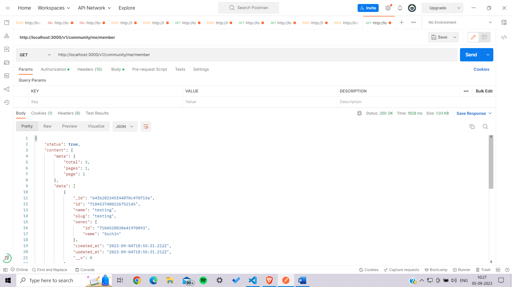
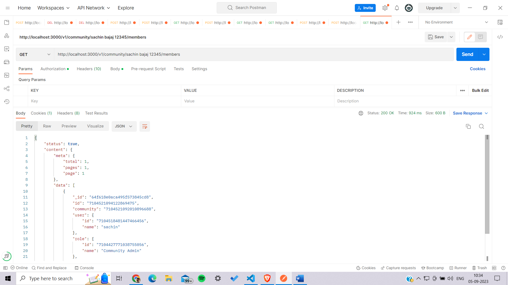
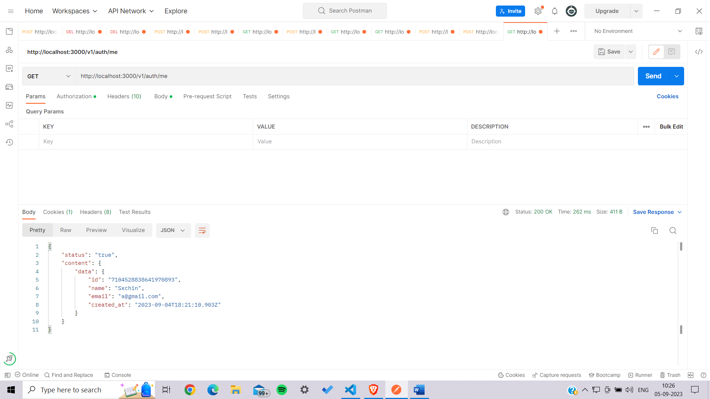
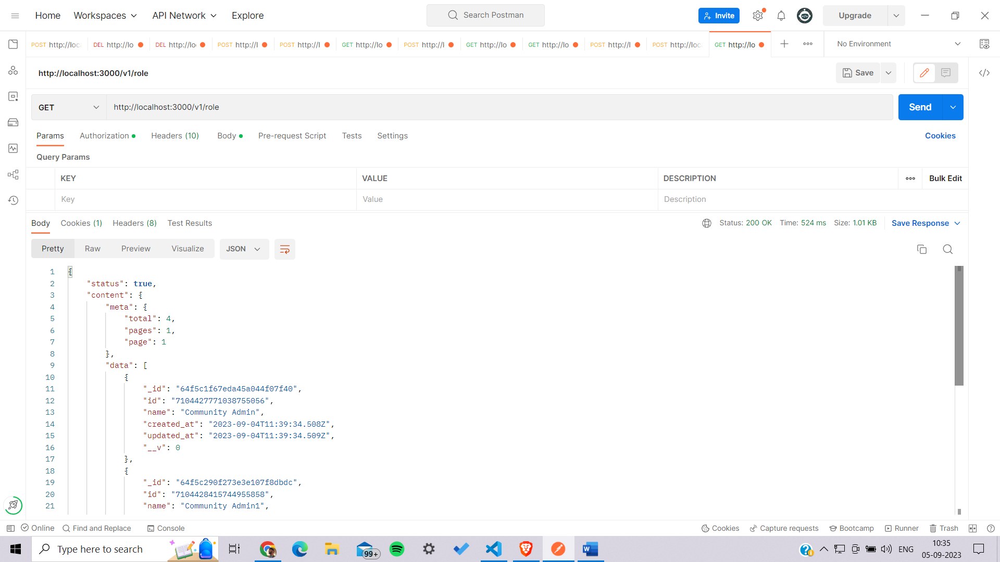
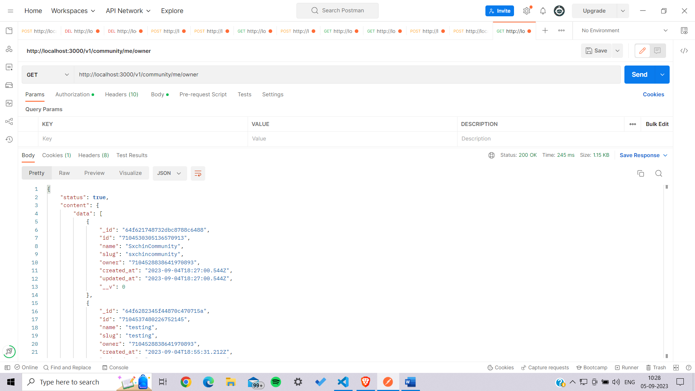

# Community-Management-System

 # Getting started

To get started with this project, follow these steps:

1. Clone the Repository
2. Install all the dependencies using "npm install"
3. Start the project using "npm start"
4. I have deployed this project on render.com you make API requests from postman on this URL: https://community-management-system.onrender.com

# API Endpoints

**Role**

1. Create	POST /v1/role
   
2. Get All	GET /v1/role
   
**User**

3. Sign Up	POST /v1/auth/signup
   
4. Sign in	POST /v1/auth/signin
   
5. Get Me	GET /v1/auth/me

**Community**

6. Create	POST /v1/community
   
7. Get All	GET /v1/community

8. Get All Members	GET /v1/community/:id/members
9. Get My Owned Community	GET /v1/community/me/owner
10. Get My Joined Community	GET /v1/community/me/member
    
**Member**

11. Add Member	POST /v1/member
12. Remove Member	DELETE /v1/member/:id

For API docs refer this: https://documenter.getpostman.com/view/14439156/2s93Jrx5Da

Hosted link: https://community-management-system.onrender.com

Member

Members

User profile

Role

Owner

